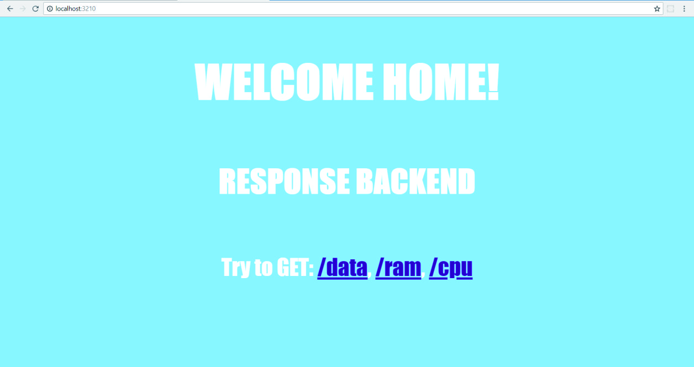
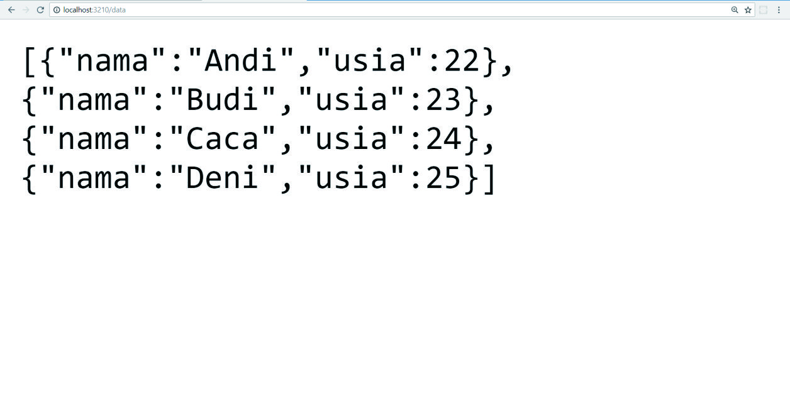
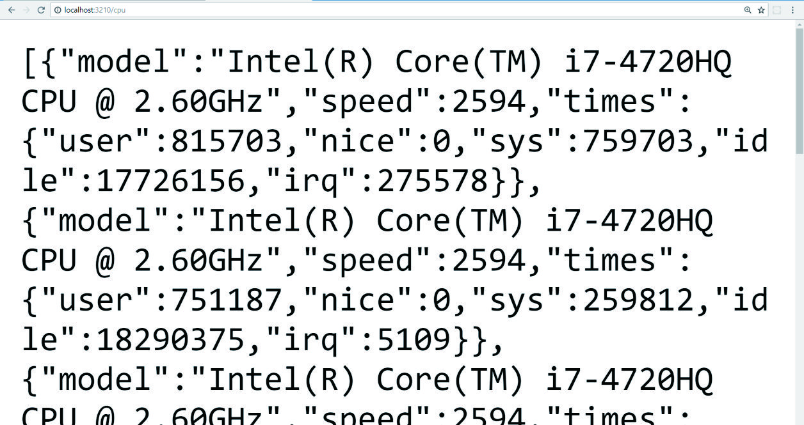
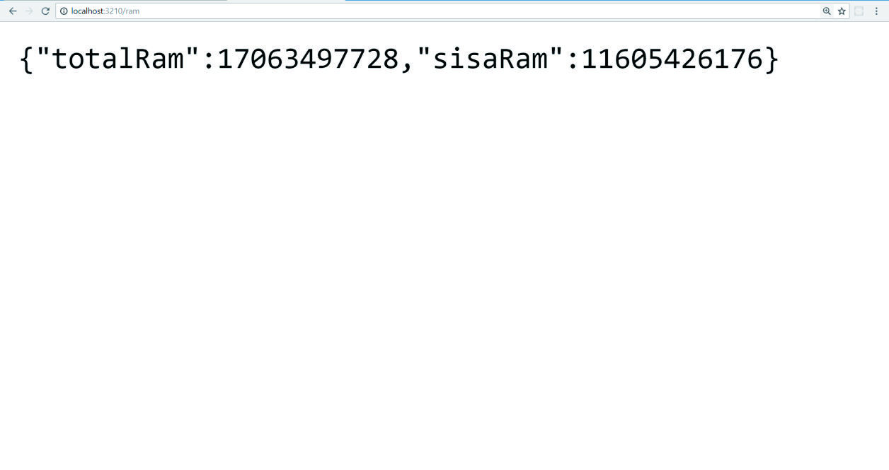

#


# __Node.JS HTTP Module__

### A simple Node.JS server using HTTP module 

In this project, we will create a simple Node.JS server project using HTTP built-in Node.JS module. 

## __:snowflake: Screenshot:__

To get started, simply clone this repo:

```bash
$ git clone https://github.com/LintangWisesa/NodeJS_HTTP_Server.git

$ cd NodeJS_HTTP_Server

$ node app
```

Then open __*http://localhost:3210*__ on your browser. Try to GET:
- http://localhost:3210/data
- http://localhost:3210/cpu
- http://localhost:3210/ram
- http://localhost:3210/error or /randomRoute

You can also run this project using __*Nodemon*__. Just install Nodemon globally then use it to run this project:

```bash
$ npm i -g nodemon

$ nodemon app
```

## __:snowflake: Screenshot:__

__*GET localhost:3210/*__



__*GET localhost:3210/data*__


__*GET localhost:3210/ram*__



__*GET localhost:3210/cpu*__



__*GET localhost:3210/error*__



__Done!__ :thumbsup:

#

#### Lintang Wisesa :love_letter: _lintangwisesa@ymail.com_

[Facebook](https://www.facebook.com/lintangbagus) |
[Twitter](https://twitter.com/Lintang_Wisesa) |
[Google+](https://plus.google.com/u/0/+LintangWisesa1) |
[Youtube](https://www.youtube.com/user/lintangbagus) | 
:octocat: [GitHub](https://github.com/LintangWisesa) |
[Hackster](https://www.hackster.io/lintangwisesa)